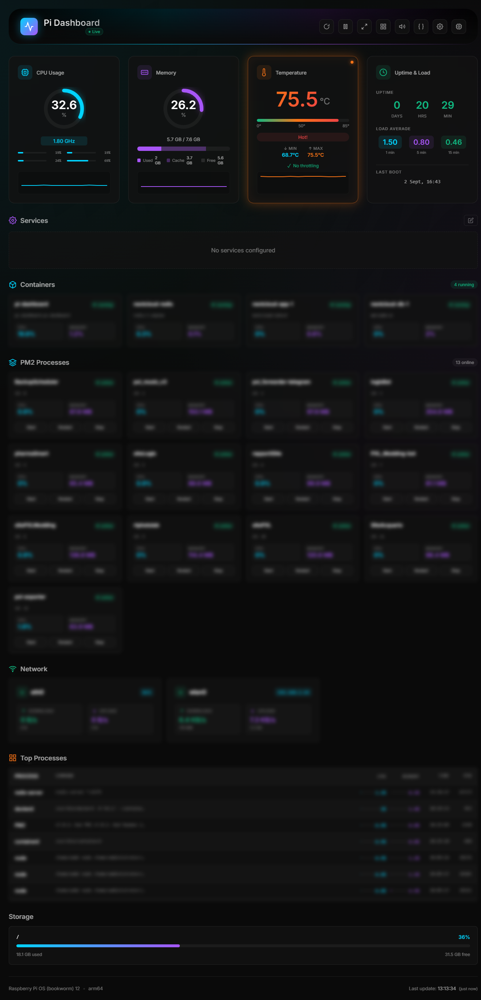

# Pi Dashboard 🖥️

A real-time monitoring dashboard for Raspberry Pi home servers.

> Fork of [zepgram/pi-dashboard](https://github.com/zepgram/pi-dashboard) with an added PM2 process manager and a login/session system to actually protect the dashboard when it's exposed.





## ✨ Features

- **Real-time monitoring** — CPU, RAM, temperature, disk usage
- **Temperature insights** — Min/max session tracking, throttling status (via vcgencmd)
- **Docker integration** — Container stats with CPU/memory usage
- **PM2 process manager** — Lists processes managed by PM2 on the host, with CPU/memory per process and Start/Restart/Stop actions from the UI
- **WireGuard VPN** — Monitor connected clients, transfer stats, last seen
- **Network stats** — Bandwidth, connections per interface
- **Service health** — HTTP, TCP, Redis, DNS health checks
- **External API** — REST API with key authentication for external apps
- **Login / session protection** — Optional token-gated access with a login screen, signed session cookies and brute-force protection (see [Security](#-security--login))
- **Modern UI** — Glassmorphism, smooth animations, dark theme
- **Display modes** — Normal, Compact, and Ultra-compact layouts
- **Multiple themes** — 5 color themes (cyan, emerald, rose, amber, indigo)
- **Persistent settings** — Server-side config, shared across devices
- **PWA ready** — Install on mobile, works offline

## 🎨 Design

Silicon/AI aesthetic inspired by Apple System Preferences meets Vercel Dashboard:
- Deep dark theme (#0a0a0a)
- Glassmorphism cards
- Cyan/purple accent gradients
- Smooth micro-interactions
- Responsive card-based layout
- Multiple color themes

## 🚀 Quick Start (local dev)

```bash
git clone https://github.com/pxlfl4me/pi-dashboard.git
cd pi-dashboard
npm install
npm run dev
```

Dashboard available at `http://localhost:5173`

## 🐳 Docker

This fork adds custom features (PM2 manager, login system) that **aren't in the public `usernamedigital/pi-dashboard` image on Docker Hub**. You need to build the image yourself from this repo — pulling the prebuilt image from Docker Hub will give you the old dashboard without any of this.

```bash
# Clone your fork
git clone https://github.com/pxlfl4me/pi-dashboard.git
cd pi-dashboard

# Data directory for persistent settings
mkdir -p data

# Admin token, kept out of git via .env
echo "ADMIN_TOKEN=$(openssl rand -hex 32)" > .env

# Build and start
docker compose up -d --build
```

Dashboard available at `http://your-pi-ip:3001`

To update after pulling new changes from GitHub:

```bash
git pull origin main
docker compose up -d --build
```

### docker-compose.yml

```yaml
services:
  pi-dashboard:
    build: .
    container_name: pi-dashboard
    restart: unless-stopped

    environment:
      - PORT=3001
      - SETTINGS_CONFIG=/app/data/settings.json
      - ADMIN_TOKEN=${ADMIN_TOKEN}   # from .env, empty = login disabled
      - CORS_ORIGINS=*

    volumes:
      # Persistent settings (dashboard config, services, API keys)
      - ./data:/app/data

      # System monitoring (required)
      - /proc:/host/proc:ro
      - /sys:/host/sys:ro
      - /:/host/root:ro

      # Docker container monitoring
      - /var/run/docker.sock:/var/run/docker.sock:ro

      # WireGuard monitoring (optional)
      - /etc/wireguard:/etc/wireguard:ro

      # PM2: connects to the HOST's pm2 daemon via its socket files.
      # ${HOME} resolves to whoever runs `docker compose up`.
      - ${HOME}/.pm2:/root/.pm2

    pid: host
    network_mode: host

    cap_add:
      - NET_ADMIN

    healthcheck:
      test: ["CMD", "wget", "-q", "--spider", "http://localhost:3001/api/health"]
      interval: 30s
      timeout: 5s
      retries: 3
```

### Key Points

| Setting | Purpose |
|---------|---------|
| `build: .` | Builds from this repo's source instead of pulling the public image |
| `pid: host` | Access host processes (top processes, accurate CPU stats) |
| `network_mode: host` | Access host network interfaces, no port mapping needed |
| `/proc:/host/proc:ro` | Read host CPU, memory, process info |
| `/sys:/host/sys:ro` | Read host temperature, disk info, cgroups |
| `/:/host/root:ro` | Read host disk usage, OS info |
| `/var/run/docker.sock` | Monitor Docker containers |
| `/etc/wireguard:ro` | Read WireGuard client configs (optional) |
| `${HOME}/.pm2:/root/.pm2` | Share the host PM2 daemon with the container |
| `cap_add: NET_ADMIN` | Required for `wg show` command |
| `./data:/app/data` | Persist settings & API keys across restarts |
| `.env` (`ADMIN_TOKEN`) | Login token, never committed to git |

### PM2 processes not showing up?

The container talks to PM2 through the socket files under `~/.pm2` on the host — it doesn't run its own PM2 daemon. Check:

```bash
pm2 -v                      # PM2 running on the host?
ls -la ~/.pm2/*.sock        # daemon socket files present?
docker exec -it pi-dashboard pm2 -v      # pm2 CLI reachable inside the container?
docker exec -it pi-dashboard pm2 jlist   # can it see your processes?
```

If `$HOME` isn't set in the environment that runs `docker compose up` (e.g. a systemd unit), replace `${HOME}/.pm2` in `docker-compose.yml` with the absolute path, e.g. `/home/youruser/.pm2`.

## 📁 Structure

```
├── server/
│   ├── index.js      # Express API, auth/session, PM2 endpoints
│   └── stats.js      # System stats + PM2 process collector
├── src/
│   ├── index.html
│   ├── main.js
│   └── style.css
├── data/
│   └── settings.json # Persistent config (mount as volume)
├── Dockerfile
├── docker-compose.yml
├── package.json
└── vite.config.js
```

## ⚙️ Configuration

All settings are stored in `settings.json` — both dashboard preferences and services:

```json
{
  "dashboard": {
    "theme": "default",
    "interval": 2,
    "sound": true,
    "compact": false,
    "thresholds": {
      "cpu": { "warning": 70, "critical": 90 },
      "memory": { "warning": 80, "critical": 95 },
      "temperature": { "warning": 65, "critical": 80 }
    }
  },
  "api": {
    "enabled": false,
    "keyHash": null
  },
  "services": [
    {
      "name": "Pi-hole Admin",
      "port": 80,
      "path": "/admin/",
      "host": "localhost",
      "checkType": "http",
      "icon": "shield",
      "enabled": true
    }
  ]
}
```

### Dashboard Settings

| Field | Description | Default |
|-------|-------------|---------|
| `theme` | Color theme (default, emerald, rose, amber, indigo) | `default` |
| `interval` | Refresh interval in seconds | `2` |
| `sound` | Enable alert sounds | `true` |
| `compact` | Compact display mode | `false` |
| `thresholds` | Warning/critical thresholds | see above |

### Service Fields

| Field | Description | Default |
|-------|-------------|---------|
| `name` | Display name | required |
| `port` | Service port | required |
| `path` | Health check path | `/` |
| `host` | Hostname | `localhost` |
| `enabled` | Show in dashboard | `true` |

## 🔧 API Endpoints

### Internal API (dashboard)

| Endpoint | Method | Description |
|----------|--------|-------------|
| `/api/stats` | GET | CPU, RAM, temp, containers, disks, PM2 processes |
| `/api/settings` | GET / PUT | Dashboard settings |
| `/api/settings/api` | GET / PUT | Enable/disable external API, generate key |
| `/api/services` | GET | Service health status |
| `/api/services/config` | GET / PUT / POST | Manage configured services |
| `/api/services/config/:index` | DELETE | Remove a service |
| `/api/services/discover` | GET | Auto-discover services on listening ports |
| `/api/sysinfo` | GET | System information |
| `/api/health` | GET | Dashboard health check (no auth) |
| `/api/wireguard` | GET | WireGuard clients status |
| `/api/settings/wireguard` | GET / PUT | WireGuard settings |
| `/api/pm2/:action/:id` | POST | `start` / `restart` / `stop` a PM2 process by id |
| `/api/auth/status` | GET | Whether login is required and whether you're logged in (no auth) |
| `/api/auth/login` | POST | `{ "token": "..." }` — logs in, sets the session cookie (no auth) |
| `/api/auth/logout` | POST | Clears the session cookie (no auth) |

When `ADMIN_TOKEN` is set, every endpoint above except `/api/health` and `/api/auth/*` requires a valid session (or the header, see below).

### External API (v1)

Public API for external applications, protected by its own API key — separate from the login system, meant for scripts/integrations rather than browsers.

| Endpoint | Method | Description |
|----------|--------|-------------|
| `/api/v1/system` | GET | Complete system data (stats + sysinfo + wireguard if enabled) |

**Authentication:** Enable API access and generate a key via the dashboard UI (API button in header).

```bash
curl -H "X-API-Key: YOUR_KEY" http://your-pi:3001/api/v1/system
curl "http://your-pi:3001/api/v1/system?key=YOUR_KEY"
```

**Response includes:** system, cpu, memory, temperature, load, os, disks, network, containers, pm2, processes, baseboard, services, wireguard (if enabled).

**Security:** API keys are hashed (SHA256) before storage. The plain key is shown only once at generation.

## 🔐 Security & Login

### Setting up ADMIN_TOKEN

```bash
openssl rand -hex 32
```

Put the result in a `.env` file next to `docker-compose.yml` (never commit this file — it's already in `.gitignore`):

```
ADMIN_TOKEN=your-generated-token-here
```

Restart with `docker compose up -d --build` for it to take effect. Leave it empty (or don't create `.env`) to run without login — fine for a trusted LAN, not recommended if the dashboard is reachable from anywhere else.

### How the login screen works

With `ADMIN_TOKEN` set:

1. Opening the dashboard shows a lock screen instead of your stats until you enter the token.
2. On a correct token, the server issues a session cookie (`HttpOnly`, `SameSite=Strict`, valid 12 hours) and the real dashboard loads.
3. From then on, every API request the page makes — stats, PM2 actions, settings changes — is authenticated through that cookie automatically. No repeated prompts.
4. When the session expires, the lock screen reappears on the next request that needs it.
5. Wrong token attempts are rate-limited: after 5 failed tries from the same IP within 10 minutes, further attempts are blocked for a while.

Without `ADMIN_TOKEN` set, the dashboard behaves like before — open access, no login screen. PM2 start/restart/stop actions are the one exception: they stay disabled regardless, since there'd be no secret to protect them with.

For scripts/automation instead of a browser session, the old header still works on every protected endpoint:

```
X-Admin-Token: your-generated-token-here
```

### General hardening

- Session cookies are `HttpOnly` (invisible to JS) and `SameSite=Strict` (blocks cross-site requests from using them)
- Token comparisons use constant-time checks to avoid timing attacks
- Security headers: `X-Frame-Options`, `X-Content-Type-Options`, `Referrer-Policy`, `Permissions-Policy`
- Rate limiting on login attempts and on config-write endpoints
- Input validation & sanitization, payload size limits
- CORS origin restrictions (`CORS_ORIGINS` env var)

| Variable | Description | Default |
|----------|-------------|---------|
| `ADMIN_TOKEN` | Login token / API auth token | _(empty = no login)_ |
| `CORS_ORIGINS` | Allowed origins (comma-separated) | `*` |
| `PORT` | Server port | `3001` |

## 📋 Requirements

- Node.js 22+
- Raspberry Pi (ARM64) or any Linux server
- Docker (optional, for container monitoring)
- PM2 on the host (optional, only needed for the PM2 section to appear)

### 💡 Raspberry Pi: Container Stats

Pi Dashboard reads container CPU from cgroups v2 (`/sys/fs/cgroup/.../cpu.stat`) and memory from `/proc/[PID]/status`. Works **without** enabling the memory cgroup controller — no kernel modifications needed.

CPU usage is normalized to 100% (total CPU capacity), not per-core.

## 🎯 Roadmap

- [x] Persistent server-side settings
- [x] Container CPU/memory stats
- [x] Smooth animations
- [x] Auto-discover services
- [x] External REST API with key auth
- [x] Multiple color themes
- [x] Mobile-friendly UI
- [x] WireGuard VPN monitoring
- [x] Temperature min/max + throttling status
- [x] Display modes (normal/compact/ultra)
- [x] PM2 process manager (list + start/restart/stop)
- [x] Login screen with session cookies and rate-limited auth
- [ ] Historical charts (last hour/day)
- [ ] Log viewer
- [ ] Multi-server support

## 📄 License

MIT — do whatever you want with it.

---

Fork maintained by [pxlfl4me](https://github.com/pxlfl4me), based on [zepgram/pi-dashboard](https://github.com/zepgram/pi-dashboard)